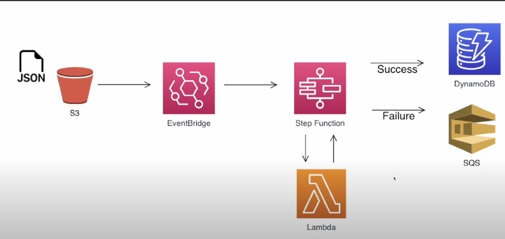
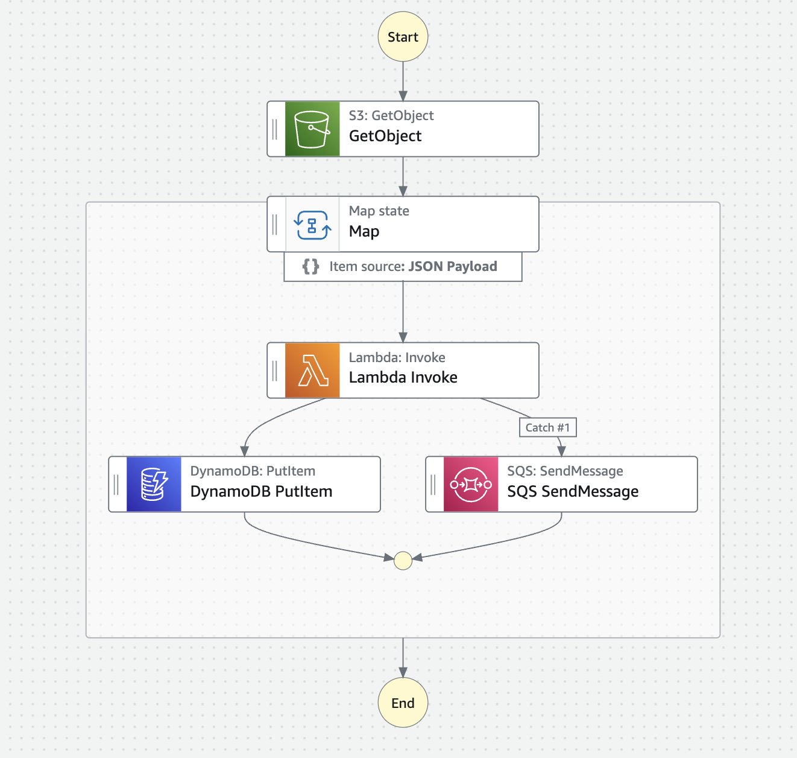
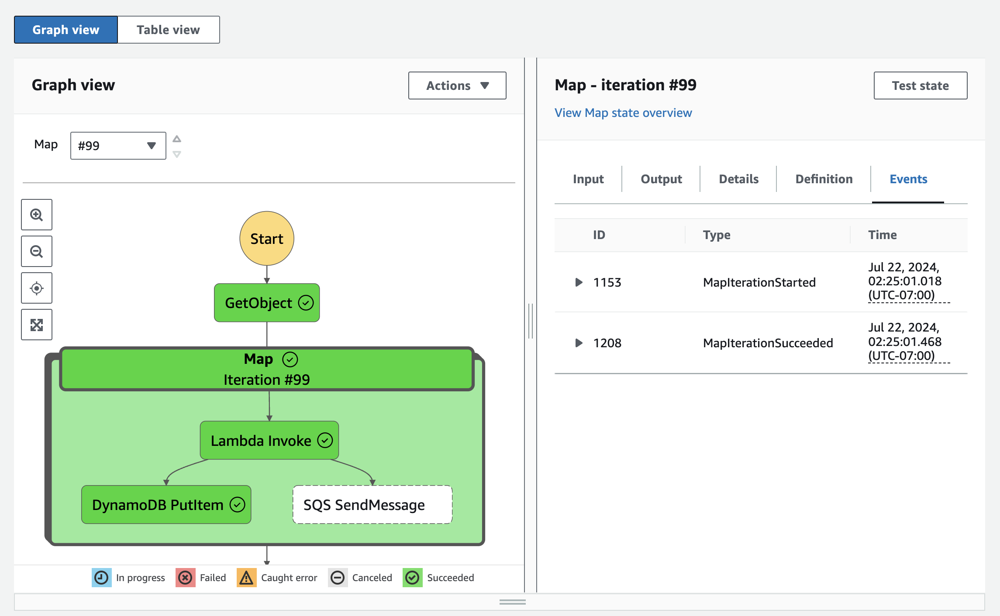
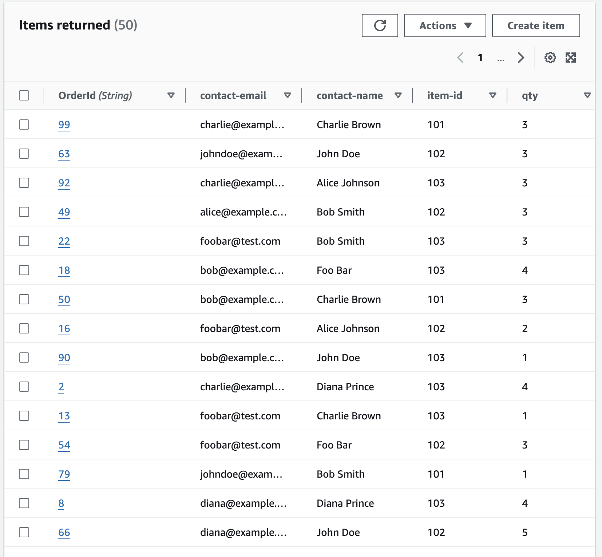
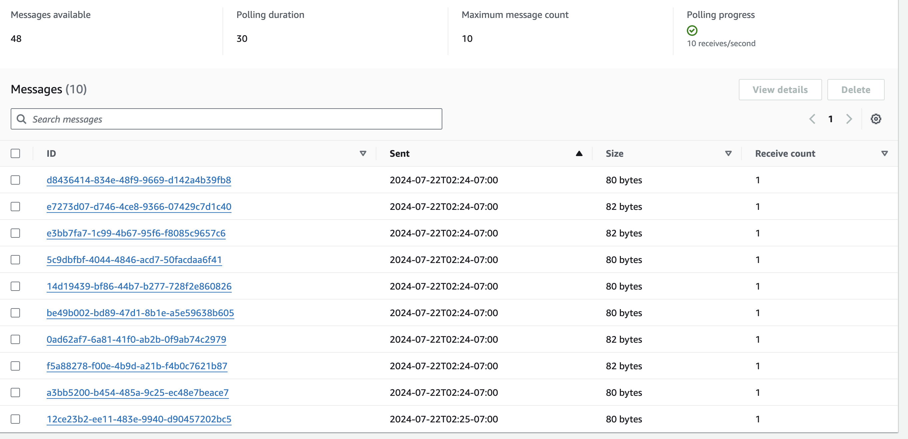

# AWS-Event-Driven Sales Data Processing

## Requirement
Sales data often arrives in JSON format, containing both order information and contact information. However, inconsistencies and incomplete records can lead to data integrity issues, complicating downstream processing and analysis.

The challenge is to design a robust, scalable, and automated system to handle incoming sales data files, validate each record, and appropriately store the data based on its validity. Specifically, the system should:

- Automatically detect and process new sales data files uploaded to an S3 bucket.
- Validate each record to ensure both the order information and contact information are present.
- Insert complete records into a DynamoDB table for reliable storage and further processing.
- Redirect incomplete records to a different place so that further inspection can be done.

The solution must be highly scalable to handle varying volumes of data, ensure data integrity, and streamline the sales data management process.

## Example records.

Here the first record has both order information and contact information but the second record has only order information.
```
{
    "orders": [
        {
            "contact-info": {
                "name": "Foo Bar",
                "email": "foobar@test.com"
            },
            "order-info": {
                "OrderId": "1",
                "item-id": "101",
                "item-desc": "Item One",
                "qty": "1"
            }
        },
        {
            "order-info": {
                "orderId": "2",
                "item-id": "102",
                "item-desc": "Item Two",
                "qty": "2"
            }
        }
    ]
}
```

## Solution Architecture


When a new sales data file is uploaded to the S3 bucket, an EventBridge rule triggers an AWS Step Functions workflow to process the file. Each record in the file is assessed in the step functions workflow using an AWS Lambda function to determine if it contains both order information and contact information.

If both order and contact information are present, the lambda function returns the record and is inserted into a DynamoDB table
by the workflow which can be used for further processing and storage.
If the contact information is missing, the lambda function raises an exception and the workflow places the record in a Dead Letter Queue (DLQ) in SQS for further inspection and correction.

### The step function workflow


Since, a single json file contains multiple records, multiple invokations of lambda function is required. To facilitate simultaneous running of the same lambda function, the lambda invoke is placed inside MAP state. all the tasks inside the map state will run simultaneously for each record in the JSON file. 

## Key Features

- Event-driven architecture: Utilizes AWS EventBridge to automatically trigger workflows upon file upload.
- Serverless processing: Leverages AWS Lambda for on-demand data validation and processing.
- State management: Uses AWS Step Functions to orchestrate the workflow and handle the logic for each record.
- Data integrity: Ensures only complete records are inserted into DynamoDB, while incomplete records are directed to an SQS DLQ.
- Scalability: Fully scalable to handle varying loads of sales data without manual intervention.

This setup provides a robust and efficient mechanism to manage sales data, ensuring high data quality and reliability.


## Sample Run

The workflow is tested using the data from mock-data.json The step function states have executed successfully for each record and the complete records are inserted in dynamoDB while the incomplete ones are pushed to an SQS queue.


#### Step Function



#### Data in DynamoDB



#### Data in SQS

